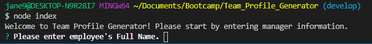
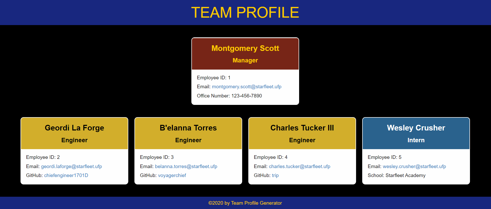

# Team Profile Generator

## Table of Contents
* [Description](#description)
* [Installation](#installation)
* [Usage](#usage)
* [Contributing](#contributing)
* [Tests](#tests)
* [License](#license)
* [Questions](#questions)

## Description <a name="description"></a>
This Javascript application is a Team Profile Generator that allows a user to input team information through the command line to generate a team profile webpage.  The webpage displays information for the team's employees, including employee name, employee role, employee ID, and email address.  The Team Manager is displayed at the top of the page and additionally includes the manager's office number.  Employees are displayed below the team manager.  Engineers on the team additionally have their GitHub username displayed.  Interns on the team additionally have their School name displayed. The intent of this Challenge was to build a Node.js command-line application, utilize object-oriented programming, as well as apply the Jest framework for testing.  No starter code was provided for this Challenge.

## Installation <a name="installation"></a>
To install this application, please do the following: 

1. Clone the application's respository from GitHub onto your local drive.  
2. Set up the npm package by typing the following into the root directory of the application: 
    
    ```
    npm install
    ```
    
    This will download the application's dependencies into your root directory.  You should now have a folder called ```node_modules``` and a file called ```package-lock.json```.

## Usage <a name="usage"></a>
Once installation is complete, to use the application, type the following into the command line at the root directory of the application:

    node index
    
The application will prompt you for a series of requirements to be input into your project README.  You should be prompted for input as shown in the screenshot below.



Once all input has been provided, the application will generate an index.html and .css file.  The webpage should look similar to this:



For a video walkthrough of the jest tests and usage procedures, please go to the following link:
https://drive.google.com/file/d/1czfL9mc3s2DOZpkpsAnhHjhKe0cONT37/view?usp=sharing

## Contributing <a name="contributing"></a>
Contributions are welcome.  Please contact me regarding improvements you would like to make.

## Tests <a name="tests"></a>
This application uses the Jest testing framework.  Tests currently exist for the ```Employee```, ```Engineer```, ```Intern```, and ```Manager``` constructors.  To run these tests or add other tests, do the following:

1. Set up the npm package by typing the following into the root directory of the application: 
    
    ```
    npm install --save-dev jest
    ```
    
    This will add Jest to the devDependencies list in the package.json file.  

2. Next, open the package.json file and revise/confirm that the ```scripts``` property has a ```test``` property with values of ```jest``` as shown below:

    ```
    "scripts": {
    "test": "jest"
    }
    ```
3. Add a ```___tests___``` directory to the root directory.  Jest will run tests from this directory.

4. Once a test has been written, run the tests with the following command:

    ```
    npm run test
    ```


## License <a name="license"></a>
This application is covered under the ISC license.

## Questions <a name="questions"></a>
My GitHub username is plainjane99.  Please feel free to peruse my other projects.

If you have any questions regarding this application, please contact me via email at jane99hsu@gmail.com.
  